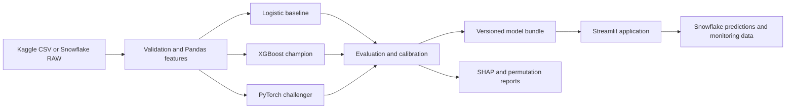

# Credit Risk Intelligence Platform

An end-to-end credit risk platform using XGBoost, PyTorch, Snowflake, and Streamlit to predict serious delinquency, address class imbalance, and deliver explainable risk assessments.

> **Status:** Project specification / proof-of-concept implementation. This system is for educational and portfolio demonstration purposes only and must not be used to make real lending decisions.

## Overview

This project builds a reproducible machine learning workflow for estimating the probability that a borrower will experience serious delinquency. It combines local development with a Snowflake-ready data layer and presents model performance, risk drivers, single-applicant scoring, and batch scoring through Streamlit.

The design is intentionally lightweight: it uses a modular monolith and Docker instead of premature microservices or Kubernetes, while keeping clear module boundaries for future API extraction, scheduled retraining, and managed cloud deployment.

## Core Capabilities

- Validated data ingestion with local and Snowflake repository implementations.
- Shared Pandas/Scikit-Learn preprocessing for training and inference.
- Logistic-regression baseline.
- Required XGBoost champion with early stopping and bounded tuning.
- PyTorch MLP challenger.
- Original-distribution, class-weighted, and SMOTE imbalance experiments.
- PR-AUC, ROC-AUC, KS, calibration, lift, and business-cost evaluation.
- Probability calibration and validation-driven threshold selection.
- XGBoost native diagnostics, permutation importance, and SHAP explanations.
- Interactive portfolio, model-performance, single-scoring, and batch-scoring pages.
- Versioned model artifacts and prediction audit metadata.
- Docker packaging and GitHub Actions quality gates.

## Data Source

The primary dataset is Kaggle's [Give Me Some Credit](https://www.kaggle.com/competitions/GiveMeSomeCredit/data). Its target, `SeriousDlqin2yrs`, indicates whether a borrower experienced 90 days past due or worse within two years.

The raw dataset is not stored in Git. Users must obtain it through Kaggle and comply with the competition terms. The dataset is anonymized and does not contain a suitable event timeline, so this project uses a reproducible stratified split rather than claiming true out-of-time validation.

The UCI [Default of Credit Card Clients](https://archive.ics.uci.edu/dataset/350) dataset may be used as an optional pipeline regression fixture, but it is not the primary project result.

## Technology Stack

| Area | Technology |
|---|---|
| Data processing | Pandas, NumPy |
| Pipelines and evaluation | Scikit-Learn, imbalanced-learn |
| Champion model | XGBoost |
| Challenger model | PyTorch |
| Explainability | SHAP, permutation importance |
| Application and charts | Streamlit, Plotly, Matplotlib/Seaborn |
| Data platform | Snowflake |
| Testing and quality | Pytest, Ruff |
| Packaging and automation | Docker, Docker Compose, GitHub Actions |

## Architecture



## Modeling Approach

Accuracy is not used to select the model because serious delinquency is a minority-class event. Average Precision/PR-AUC is the primary model-selection metric, supported by ROC-AUC, KS, recall, precision, F1, Brier score, calibration curves, and an explicit business-cost analysis.

XGBoost is evaluated with the original class distribution, `scale_pos_weight`, and SMOTE. SMOTE is applied only inside training folds; validation and test sets retain the real class distribution. The winning model is calibrated where beneficial, and its operating threshold is selected on validation data rather than defaulting to 0.5.

Native XGBoost gain, weight, and cover are treated as diagnostics only. Final model inspection combines repeated held-out permutation importance with SHAP global and local explanations. Correlated features and explanation stability are analyzed explicitly, and explanations are described as model attribution rather than causality.

## Application Experience

The planned Streamlit application includes:

- **Portfolio Overview:** target balance, data quality, missingness, distributions, and correlations.
- **Model Performance:** model comparison, PR/ROC curves, calibration, confusion matrix, lift, threshold economics, and global explanations.
- **Single Applicant:** validated inputs, calibrated probability, demo risk band, threshold context, and local SHAP explanation.
- **Batch Scoring:** schema-validated CSV upload, downloadable predictions, distribution summary, and optional Snowflake writeback.

The interface does not request names or direct personally identifiable information.

## Snowflake Layout

Snowflake is organized into four logical layers:

| Schema | Purpose |
|---|---|
| `RAW` | Source-aligned records and ingestion metadata |
| `CURATED` | Validated and cleaned cases |
| `FEATURES` | Model-ready feature snapshots |
| `SERVING` | Predictions, model versions, and monitoring inputs |

Local CSV/Parquet and Snowflake access implement the same repository interface so that the application can switch backends through configuration.

## Repository Layout

```text
├── app/                 # Streamlit pages and components
├── configs/             # Versioned model and runtime configuration
├── data/                # Local data; ignored by Git
├── docs/                # Requirements, model card, data dictionary, runbook
├── notebooks/           # Exploration only
├── scripts/             # Download, preparation, training, evaluation, loading
├── sql/                 # Snowflake DDL and monitoring views
├── src/ml_risk_control/ # Production data, feature, model, evaluation, and services
├── tests/               # Unit, integration, fixture, and smoke tests
├── Dockerfile
├── compose.yaml
└── pyproject.toml
```

Production logic belongs in `src/`; notebooks must import shared modules rather than becoming an alternative implementation.

## Planned Local Workflow

Once implementation is complete, the standard workflow will be exposed through Make targets or equivalent commands:

```bash
make setup
make data
make train
make evaluate
make app
make test
```

Container execution will be available through:

```bash
docker compose up --build
```

Snowflake credentials and other secrets will be supplied externally. `.env.example` will document required variable names without storing credentials.

## Quality and Reproducibility

The final model bundle records the preprocessing pipeline, feature schema, model configuration, calibration state, thresholds, risk bands, metrics, dependency versions, random seeds, training time, and data fingerprint.

CI validates linting, unit and integration tests, a lightweight training smoke test, and the Docker build. Tests do not require live Snowflake credentials by default.

## Documentation

The complete scope, acceptance criteria, architecture, and implementation roadmap are defined in [docs/PROJECT_REQUIREMENTS.md](docs/PROJECT_REQUIREMENTS.md).

Planned supporting documents include:

- `docs/DATA_DICTIONARY.md`
- `docs/MODEL_CARD.md`
- `docs/RUNBOOK.md`

## Limitations

- The benchmark dataset is anonymized and lacks a reliable time field.
- Results do not constitute regulatory model validation.
- SHAP and permutation importance explain model behavior, not causal relationships.
- Demo thresholds and risk bands are not lending policy.
- The project must not be used for real customer decisions.
