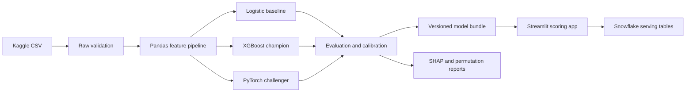

# Credit Risk Intelligence Platform

## Detailed Project Requirements and Ten-Stage Implementation Roadmap

| Document Field | Value |
|---|---|
| Status | Approved project baseline |
| Delivery model | Ten-stage proof-of-concept roadmap |
| Primary use case | Explainable prediction of serious credit delinquency |
| Primary model | XGBoost binary classifier |
| Challenger model | PyTorch multilayer perceptron |
| Primary data source | Kaggle "Give Me Some Credit" |
| Target deployment | Dockerized Streamlit application with Snowflake integration |

## 1. Executive Summary

The Credit Risk Intelligence Platform is an end-to-end machine learning proof of concept that predicts the probability of a borrower experiencing serious delinquency. It covers data ingestion, validation, feature engineering, model training, class-imbalance experiments, probability calibration, explainability, interactive scoring, data persistence, testing, and deployment automation.

The project is deliberately lightweight and organized into ten implementation stages while retaining clear extension points for larger datasets, scheduled retraining, model registries, independent inference APIs, and cloud deployment. It will be implemented as a modular monolith rather than as a collection of microservices.

The final system must demonstrate not only predictive performance, but also why a prediction was made, whether the predicted probabilities are reliable, how the decision threshold was selected, and how the system behaves under the naturally imbalanced class distribution of credit-risk data.

## 2. Project Objectives

The project must:

1. Build a reproducible credit-risk data pipeline using Pandas and Snowflake.
2. Train an XGBoost model as the required champion model.
3. Train a Scikit-Learn logistic-regression baseline and a PyTorch MLP challenger.
4. Compare class-imbalance strategies without contaminating validation or test data.
5. Evaluate discrimination, minority-class performance, calibration, and business cost.
6. Provide global and customer-level explanations using SHAP and permutation importance.
7. Provide an interactive Streamlit interface for single-record and batch scoring.
8. Persist prediction metadata and model-monitoring inputs in Snowflake.
9. Package the application with Docker and validate it through CI.
10. Produce sufficient documentation for another developer to reproduce and extend the project.

## 3. Scope

### 3.1 In Scope

- Acquisition and validation of the Kaggle "Give Me Some Credit" dataset.
- Local CSV-based development with a Snowflake-backed data-access option.
- Exploratory data analysis and a documented data dictionary.
- Missing-value, outlier, and leakage analysis.
- Reproducible feature engineering.
- Logistic-regression, XGBoost, and PyTorch MLP experiments.
- Class weighting, `scale_pos_weight`, and SMOTE comparisons.
- Hyperparameter search with bounded compute usage.
- Probability calibration and business-driven threshold selection.
- ROC, precision-recall, calibration, lift, and cost visualizations.
- XGBoost gain diagnostics, held-out permutation importance, and SHAP explanations.
- Streamlit dashboards for portfolio analysis and scoring.
- Snowflake schemas for raw, curated, feature, and serving data.
- Unit, integration, data-contract, and application smoke tests.
- Docker packaging and GitHub Actions CI.
- Model card, dataset notes, runbook, and project documentation.

### 3.2 Out of Scope for the Initial PoC

- Real lending or adverse-action decisions.
- Use of personally identifiable information.
- Real-time integrations with banking, bureau, or payment systems.
- Kubernetes or service-mesh deployment.
- Independent training, feature-store, and inference microservices.
- A production-grade online feature store.
- Fully automated scheduled retraining.
- Formal regulatory validation or approval.
- Causal interpretation of model explanations.
- An LLM participating in risk scoring or threshold selection.

## 4. Users and Core Workflows

### 4.1 Intended Users

- **Risk analyst:** reviews portfolio performance, thresholds, and risk drivers.
- **Model developer:** reproduces experiments and compares model versions.
- **Reviewer or recruiter:** launches the application and examines the full ML lifecycle.
- **Platform developer:** replaces local storage with Snowflake or extends deployment.

### 4.2 Core Workflows

#### Portfolio Analysis

The user reviews class balance, feature distributions, missingness, model metrics, calibration, threshold trade-offs, and aggregate SHAP results.

#### Single-Applicant Scoring

The user enters or selects model features, receives a calibrated probability of serious delinquency, a risk band, a recommended demo action, and a local SHAP explanation.

#### Batch Scoring

The user uploads a contract-compliant CSV, validates it, scores all valid rows, reviews the output distribution, and downloads the results.

#### Model Comparison

The user compares logistic regression, XGBoost, and PyTorch models using the same untouched test set and the same evaluation definitions.

## 5. Data Foundation

### 5.1 Primary Dataset

The primary dataset is the Kaggle competition dataset [Give Me Some Credit](https://www.kaggle.com/competitions/GiveMeSomeCredit/data).

The training data contains anonymized borrower attributes and the binary target `SeriousDlqin2yrs`, which represents whether a borrower experienced 90 days past due or worse within two years. It is selected because it is a recognized credit-scoring benchmark, has a naturally imbalanced target, is large enough for meaningful model evaluation, and remains small enough for local iteration.

### 5.2 Data Governance Requirements

- The raw dataset must not be committed to Git.
- Acquisition must be documented through a Kaggle API or manual-download procedure.
- Users must accept and comply with Kaggle competition terms.
- The repository must not infer the original competition license from a third-party mirror.
- A checksum or equivalent raw-file fingerprint must be recorded for reproducibility.
- No attempt may be made to identify individuals represented in the data.
- Dataset limitations must be disclosed in the model card and UI.

### 5.3 Dataset Limitations

- The originating financial institution is anonymized.
- The data does not contain a reliable event timestamp for true out-of-time validation.
- The feature set is narrower than a production bureau or transaction dataset.
- The dataset is suitable for a technical PoC, not for a real credit policy.

### 5.4 Optional Validation Dataset

The UCI [Default of Credit Card Clients](https://archive.ics.uci.edu/dataset/350) dataset may be used only as an optional pipeline regression fixture or secondary benchmark. It is not the primary project result.

### 5.5 Data Splitting

Because the primary dataset has no suitable event timeline, the project must use a reproducible stratified split:

- Training set: 70%
- Validation set: 15%
- Test set: 15%

The test set must remain untouched until the final candidate and threshold have been selected. Cross-validation, resampling, feature selection, and hyperparameter search must operate only on the training partition. Calibration and threshold selection must use validation data or a dedicated calibration split, never the final test set.

### 5.6 Data Quality Checks

The pipeline must validate:

- Required columns and expected data types.
- Target values restricted to zero and one.
- Unique row identifier behavior.
- Duplicate rows.
- Missing-value rates.
- Infinite values and invalid numeric parsing.
- Domain constraints such as non-negative counts and plausible age ranges.
- Extreme values requiring capping, transformation, or explicit retention.
- Training-serving feature parity.

Data validation failures must produce actionable messages and a non-zero command exit status.

## 6. Technical Architecture

### 6.1 Architectural Style

The application will be a modular monolith. Data access, feature engineering, training, evaluation, explainability, and inference must have explicit module boundaries, but they will be packaged and deployed together for the PoC.

Microservices are intentionally deferred because the expected workload does not justify independent scaling or operational overhead. The inference-service interface must nevertheless avoid direct coupling between Streamlit widgets and model internals, making a future FastAPI extraction straightforward.

### 6.2 Logical Flow



### 6.3 Required Technology Stack

| Layer | Technology | Purpose |
|---|---|---|
| Language | Python 3.11 | Consistent local and container runtime |
| Data processing | Pandas, NumPy | Data loading, validation, transformation, analysis |
| ML framework | Scikit-Learn | Pipelines, baseline, metrics, splitting, calibration |
| Champion model | XGBoost | Required gradient-boosted tree model |
| Challenger model | PyTorch | Lightweight neural-network comparison |
| Imbalance handling | imbalanced-learn | SMOTE and resampling-aware pipelines |
| Explainability | SHAP, Scikit-Learn permutation importance | Global and local model inspection |
| Visualization | Streamlit, Plotly, Matplotlib/Seaborn | Interactive and static plots |
| Data platform | Snowflake, Snowflake Python Connector | Warehouse storage and serving integration |
| Artifact format | Joblib, JSON, PyTorch state dict | Reproducible model bundle |
| Quality | Pytest, Ruff, mypy where practical | Tests, linting, static checks |
| Packaging | Docker, Docker Compose | Reproducible application runtime |
| Automation | GitHub Actions | CI and optional deployment workflow |

### 6.4 Configuration and Secrets

- Environment-specific settings must be externalized.
- `.env.example` may define variable names but must not contain credentials.
- Snowflake credentials must be supplied through environment variables, a local Snowflake connection profile, or platform secrets.
- Local CSV mode must remain available when Snowflake is not configured.
- Secrets, raw data, generated predictions, and large model artifacts must be excluded from Git.

## 7. Prescribed Repository Structure

```text
ml_risk_control/
├── .github/
│   └── workflows/
│       ├── ci.yml
│       └── deploy.yml                 # Optional/manual deployment
├── .streamlit/
│   └── config.toml
├── app/
│   ├── Home.py
│   ├── pages/
│   │   ├── 1_Portfolio_Overview.py
│   │   ├── 2_Model_Performance.py
│   │   ├── 3_Single_Applicant.py
│   │   └── 4_Batch_Scoring.py
│   └── components/
├── artifacts/                         # Generated; ignored except metadata examples
├── configs/
│   ├── base.yaml
│   ├── model_xgb.yaml
│   └── model_torch.yaml
├── data/
│   ├── raw/                           # Ignored
│   ├── interim/                       # Ignored
│   └── processed/                     # Ignored
├── docs/
│   ├── PROJECT_REQUIREMENTS.md
│   ├── DATA_DICTIONARY.md
│   ├── MODEL_CARD.md
│   └── RUNBOOK.md
├── notebooks/                         # Exploration only; no production logic
├── reports/
│   └── figures/                       # Generated charts
├── scripts/
│   ├── download_data.py
│   ├── prepare_data.py
│   ├── train.py
│   ├── evaluate.py
│   └── load_snowflake.py
├── sql/
│   ├── 001_create_schemas.sql
│   ├── 002_create_tables.sql
│   └── 003_monitoring_views.sql
├── src/
│   └── ml_risk_control/
│       ├── __init__.py
│       ├── config.py
│       ├── data/
│       │   ├── contracts.py
│       │   ├── repositories.py
│       │   └── validation.py
│       ├── features/
│       │   ├── build.py
│       │   └── transformers.py
│       ├── models/
│       │   ├── baseline.py
│       │   ├── xgboost_model.py
│       │   ├── torch_model.py
│       │   ├── calibration.py
│       │   └── registry.py
│       ├── evaluation/
│       │   ├── metrics.py
│       │   ├── threshold.py
│       │   └── plots.py
│       ├── explainability/
│       │   ├── permutation.py
│       │   └── shap_explainer.py
│       └── services/
│           ├── inference.py
│           └── batch.py
├── tests/
│   ├── unit/
│   ├── integration/
│   ├── fixtures/
│   └── test_app_smoke.py
├── .dockerignore
├── .env.example
├── .gitignore
├── compose.yaml
├── Dockerfile
├── Makefile
├── pyproject.toml
├── README.md
└── snowflake.yml                     # If Streamlit in Snowflake is used
```

Production logic must live in `src/`; notebooks may import production modules but must not be the sole implementation of any required pipeline.

## 8. Snowflake Design

### 8.1 Required Schemas

| Schema | Responsibility |
|---|---|
| `RAW` | Immutable source-aligned records and ingestion metadata |
| `CURATED` | Validated and cleaned records |
| `FEATURES` | Model-ready feature snapshots |
| `SERVING` | Prediction results, model versions, and monitoring inputs |

### 8.2 Minimum Tables

- `RAW.GMSC_TRAIN`
- `CURATED.CREDIT_RISK_CASES`
- `FEATURES.CREDIT_RISK_FEATURES`
- `SERVING.MODEL_PREDICTIONS`
- `SERVING.MODEL_VERSIONS`
- `SERVING.DATA_QUALITY_RUNS`

### 8.3 Prediction Audit Fields

Every persisted prediction must include:

- Prediction identifier.
- Anonymous source-row identifier.
- Model name and semantic version.
- Feature-schema version.
- Raw and calibrated probabilities.
- Decision threshold.
- Risk band and demo action.
- Scoring timestamp.
- Input-source identifier.
- Optional explanation summary without sensitive raw values.

### 8.4 Data Access Abstraction

The same service layer must work with:

- `LocalRepository` for CSV/Parquet development.
- `SnowflakeRepository` for warehouse-backed execution.

Application code must select the repository through configuration rather than conditional logic scattered across pages.

## 9. Modeling Requirements

### 9.1 Feature Processing

- The row identifier must never be used as a predictive feature.
- Missing-value handling must be learned from training data only.
- Count and ratio features must receive domain-aware treatment.
- Extreme values must be investigated before clipping; all transformations must be documented.
- Feature names, order, types, defaults, and allowed ranges must be saved as a versioned schema.
- Training and inference must invoke the same serialized transformation pipeline.

### 9.2 Logistic-Regression Baseline

The baseline must use a Scikit-Learn pipeline with imputation and scaling. It provides an interpretable performance floor and a check that model complexity produces meaningful incremental value.

### 9.3 XGBoost Champion

XGBoost is mandatory and must be the primary candidate. The training workflow must include:

- Binary logistic objective.
- PR-AUC-oriented model selection.
- Early stopping on validation data.
- Reproducible seeds.
- Bounded hyperparameter search.
- Regularization and depth controls.
- `scale_pos_weight` as an explicit experiment.
- Versioned configuration and metrics.
- CPU-compatible inference.

The search space should prioritize `max_depth`, `min_child_weight`, `learning_rate`, `n_estimators`, `subsample`, `colsample_bytree`, `gamma`, `reg_alpha`, and `reg_lambda` without creating an unnecessarily expensive optimization run.

### 9.4 PyTorch Challenger

The challenger must be a compact feed-forward network:

- Two or three hidden layers.
- Batch normalization and/or dropout where justified.
- `BCEWithLogitsLoss` with an optional positive-class weight.
- Early stopping.
- CPU-first training with optional GPU use.
- Saved preprocessing pipeline and state dictionary.

Its purpose is comparative engineering coverage, not forced promotion. It must use the same partitions and evaluation definitions as the other models.

### 9.5 Class-Imbalance Experiments

At minimum, XGBoost must be evaluated under:

1. Original distribution with no rebalancing.
2. `scale_pos_weight = negative_count / positive_count` or a tuned nearby value.
3. SMOTE inside an `imblearn` training pipeline.

SMOTE must run only within training folds. Validation and test distributions must remain untouched. The selected strategy must be justified by testable evidence rather than by assumption.

### 9.6 Probability Calibration

The best discrimination model must be checked for calibration. Platt/sigmoid and isotonic calibration may be compared where sample size permits. The selected calibrated model must report:

- Brier score.
- Calibration curve.
- Calibration intercept/slope if implemented.
- Difference between raw and calibrated probability distributions.

### 9.7 Threshold and Risk Bands

The final classification threshold must not default automatically to 0.5. It must be chosen on validation data using an explicit cost matrix and/or an operating constraint such as minimum bad-case recall.

Risk bands must be configuration-driven. An initial demonstration scheme may be:

- Low risk: probability below the lower threshold.
- Medium risk: probability between lower and upper thresholds.
- High risk: probability at or above the upper threshold.

The exact cutoffs must be derived from validation results and documented; they must not be presented as a real lending policy.

## 10. Evaluation Requirements

### 10.1 Primary Metrics

- PR-AUC / Average Precision: primary model-selection metric.
- ROC-AUC: discrimination across thresholds.
- KS statistic: separation between positive and negative cases.
- Recall, precision, and F1 at the selected threshold.
- Recall at a fixed precision or review-rate constraint.
- Brier score and calibration diagnostics.
- Expected cost under the documented cost matrix.

Accuracy may be displayed only as a secondary metric and must never drive model selection.

### 10.2 Evaluation Protocol

- All candidate models must use identical final test rows.
- Test metrics must include confidence intervals where practical, using bootstrap resampling.
- The report must include confusion matrices in both counts and normalized form.
- Results must identify the threshold and whether probabilities are calibrated.
- Metrics must be exported to machine-readable JSON as well as rendered charts.
- Random seeds and package versions must be recorded.

### 10.3 Champion Selection

The selected champion must:

1. Meet the minimum recall or cost requirement.
2. Provide calibrated or acceptably calibrated probabilities.
3. Lead or remain competitive on test PR-AUC.
4. Remain stable across folds and random seeds.
5. Support reliable batch and interactive inference.

XGBoost remains the designated platform champion unless validation exposes a material defect. Any exception must be documented rather than silently substituting another model.

## 11. Explainability Requirements

### 11.1 XGBoost Native Importance

Gain, weight/frequency, and cover must be exported as model diagnostics. They must not be presented as the sole or definitive measure of feature importance because split-based importance can favor high-cardinality features and reflects training behavior rather than generalization.

### 11.2 Permutation Importance

- Compute on held-out validation or test data.
- Use Average Precision as the primary scoring function and ROC-AUC as a secondary view.
- Run at least 10 repeated permutations.
- Report mean importance and standard deviation.
- Investigate correlated features using Spearman correlation clustering.
- Use grouped permutation or representative-feature sensitivity analysis when correlation makes individual rankings misleading.

### 11.3 SHAP

The project must generate:

- Global mean absolute SHAP ranking.
- SHAP beeswarm plot.
- Dependence plots for key risk drivers.
- Local waterfall plot for a selected applicant.
- Cohort comparison between positive and negative target groups where practical.

SHAP output must clearly state whether it explains raw margin or calibrated probability. The UI and model card must state that SHAP values describe model behavior, not causal effects.

### 11.4 Explanation Stability

Top-feature rankings must be compared across folds or repeated seeds. The report should include Top-K overlap or rank correlation so that unstable explanations are visible.

## 12. Streamlit Product Requirements

### 12.1 Page 1: Home and Project Context

- Concise project description.
- Dataset and target definition.
- Current champion model and version.
- Disclaimer that results are for demonstration only.
- Navigation to analysis and scoring pages.

### 12.2 Page 2: Portfolio Overview

- Total rows and positive-class rate.
- Missingness chart.
- Target distribution.
- Feature distributions and outlier views.
- Correlation overview.
- Optional Snowflake source/run status.

### 12.3 Page 3: Model Performance

- Model comparison table.
- ROC curves.
- Precision-recall curves with prevalence baseline.
- Calibration curves.
- Confusion matrix at selected threshold.
- Threshold-versus-cost/recall/precision chart.
- Lift or cumulative-gains chart.
- Native, permutation, and SHAP global-importance views.

### 12.4 Page 4: Single-Applicant Scoring

- Validated inputs using human-readable labels.
- No name or direct PII field.
- Calibrated delinquency probability.
- Risk band and demo action.
- Threshold context.
- Local SHAP waterfall or equivalent driver list.
- Model version and scoring timestamp.

### 12.5 Page 5: Batch Scoring

- CSV upload and schema validation.
- Clear row-level validation errors.
- Batch probability and risk-band generation.
- Distribution summary and flagged-case count.
- Downloadable result file.
- Optional writeback to Snowflake.

### 12.6 Visualization Standards

- Use consistent colors for low, medium, and high risk.
- Never rely on color alone; include labels and values.
- Include metric definitions and tooltips.
- Display the positive-class prevalence on PR plots.
- Make thresholds and calibration status explicit.
- Limit decimal precision appropriately.
- Cache model and data resources safely to avoid repeated loading.

## 13. Artifact and Reproducibility Requirements

The champion bundle must contain:

- Serialized preprocessing pipeline.
- Serialized XGBoost model.
- Optional calibrated classifier wrapper.
- Feature schema and data contract.
- Threshold and risk-band configuration.
- Training configuration.
- Metrics JSON.
- Package versions.
- Training timestamp and random seeds.
- Data fingerprint.
- SHAP background-sample metadata where required.

The application must refuse to score inputs that do not match the saved feature contract.

## 14. Testing and Quality Requirements

### 14.1 Unit Tests

- Data validators and domain rules.
- Feature transformations.
- Metric and KS calculations.
- Threshold optimization.
- Risk-band assignment.
- Inference input/output contract.

### 14.2 Integration Tests

- Raw fixture through transformed feature matrix.
- Small training run through saved artifact and reload.
- Local repository and mocked Snowflake repository behavior.
- Batch scoring with valid and invalid rows.

### 14.3 Smoke Tests

- Streamlit application imports and starts.
- Docker image builds.
- Champion artifact loads and produces finite probabilities.
- A deterministic fixture produces the expected schema and risk band.

### 14.4 Code Quality

- Ruff linting and formatting must pass.
- Public modules should include type hints.
- Core services should avoid hidden global state.
- Tests must not require live Snowflake credentials by default.
- CI must use a small fixture rather than downloading the full Kaggle dataset.

## 15. Containerization and CI/CD

### 15.1 Docker

- Use a slim Python base image.
- Run as a non-root user.
- Pin project dependencies through `pyproject.toml` and a lock strategy.
- Add a health check where practical.
- Keep raw data and secrets outside the image.
- Start Streamlit through a documented container command.

### 15.2 Continuous Integration

Every pull request and main-branch push must run:

1. Dependency installation.
2. Ruff lint/format check.
3. Unit and integration tests.
4. Small-model training smoke test.
5. Docker build.

### 15.3 Continuous Deployment

The PoC may use a manually triggered deployment workflow. Supported targets may include a generic container platform or Streamlit in Snowflake. Automatic production deployment is not required.

Deployment must not run when tests fail, and no workflow may print credentials.

## 16. Final Project Deliverables

The project is complete only when it includes:

1. Reproducible data acquisition and validation scripts.
2. Data dictionary and documented dataset limitations.
3. Logistic-regression baseline results.
4. XGBoost champion with imbalance experiments and bounded tuning.
5. PyTorch MLP challenger results.
6. Calibration and business-threshold analysis.
7. Native importance, permutation importance, and SHAP reports.
8. Functional Streamlit application for portfolio, single, and batch use.
9. Local and Snowflake repository implementations.
10. Snowflake DDL and loading scripts.
11. Versioned model artifact bundle.
12. Automated tests and CI workflow.
13. Dockerfile and Compose configuration.
14. README, model card, data dictionary, and operations runbook.
15. Final comparison report and demonstration dataset/sample inputs.

## 17. Definition of Done

The PoC is accepted when:

- A new developer can follow the README and run the local application.
- The same feature pipeline is used for training and inference.
- XGBoost is trained and evaluated as the champion candidate.
- The untouched test set is not used for tuning, calibration, or threshold selection.
- PR-AUC, ROC-AUC, KS, calibration, and business-cost results are available.
- At least three class-imbalance strategies are compared without leakage.
- Global and local explanations are visible and appropriately qualified.
- Single and batch scoring work with contract validation.
- Predictions include model and schema versions.
- Snowflake scripts create the required schemas and tables.
- The application runs in Docker.
- CI passes linting, tests, training smoke test, and image build.
- Raw data, credentials, and PII are absent from Git.
- Known limitations and non-production status are conspicuous.

## 18. Ten-Stage Implementation Roadmap

### Stage 1 — Project Foundation and Data Acquisition

#### Stage Objectives

- Initialize the prescribed repository structure.
- Configure Python packaging, linting, testing, Git ignores, and environment templates.
- Document Kaggle access and download the dataset outside Git.
- Implement raw schema validation and generate a data fingerprint.
- Draft the data dictionary and record dataset limitations.

#### Stage Deliverables

- Runnable project skeleton.
- `pyproject.toml`, `.gitignore`, `.env.example`, and baseline Make targets.
- Data acquisition script or documented manual fallback.
- Raw-data validation report.
- Initial `DATA_DICTIONARY.md`.

#### Exit Criteria

- A clean environment can install the project.
- The raw CSV passes explicit schema checks.
- No raw data or secret is tracked by Git.

### Stage 2 — EDA, Data Quality, and Snowflake Foundation

#### Stage Objectives

- Profile class balance, missingness, duplicates, distributions, and extreme values.
- Investigate suspicious values such as implausible ages and unusually large delinquency counts.
- Define target, identifier exclusions, and transformation decisions.
- Create Snowflake schema/table DDL.
- Implement initial local and Snowflake repository interfaces.

#### Stage Deliverables

- Reproducible EDA report and figures.
- Data-quality rules with tests.
- Snowflake DDL scripts.
- Repository interfaces and local implementation.

#### Exit Criteria

- Every source feature has a documented treatment decision.
- Data-quality failures are reproducible and actionable.
- Snowflake object definitions cover raw through serving layers.

### Stage 3 — Feature Pipeline and Logistic Baseline

#### Stage Objectives

- Create reproducible stratified train/validation/test partitions.
- Build the shared preprocessing and feature-schema pipeline.
- Train logistic regression as the baseline.
- Implement core metrics including PR-AUC, ROC-AUC, KS, Brier score, and confusion matrix.
- Save baseline artifacts and metrics.

#### Stage Deliverables

- Versioned split metadata.
- Feature pipeline and schema.
- Logistic baseline artifact.
- Baseline evaluation report.

#### Exit Criteria

- Training and inference transformations are identical.
- Identifier leakage is excluded.
- Baseline metrics can be regenerated from one command.

### Stage 4 — XGBoost Champion Candidate

#### Stage Objectives

- Implement the XGBoost training module.
- Establish an untuned reference model.
- Add early stopping and validation monitoring.
- Run bounded hyperparameter search.
- Capture training configuration, curves, metrics, and artifacts.

#### Stage Deliverables

- Reproducible XGBoost training workflow.
- Reference and tuned candidate metrics.
- Saved XGBoost artifact and configuration.
- Initial native gain/weight/cover diagnostics.

#### Exit Criteria

- The candidate trains on CPU and reloads successfully.
- Search does not touch the final test set.
- The tuned candidate produces finite probabilities and complete metadata.

### Stage 5 — Imbalance Strategy and Calibration

#### Stage Objectives

- Compare original-distribution, `scale_pos_weight`, and SMOTE training.
- Guarantee that SMOTE occurs only inside training folds.
- Compare PR-AUC, recall/precision trade-offs, and calibration.
- Calibrate the strongest candidate.
- Define and evaluate a business cost matrix and operating threshold.

#### Stage Deliverables

- Imbalance experiment matrix.
- Raw-versus-calibrated evaluation report.
- Threshold and cost-analysis charts.
- Selected XGBoost candidate configuration.

#### Exit Criteria

- No resampling leakage is present.
- Model selection is based on PR-AUC and operating requirements, not accuracy.
- Final threshold selection is documented and independent of test tuning.

### Stage 6 — Explainability and Stability

#### Stage Objectives

- Export XGBoost native importance diagnostics.
- Compute repeated held-out permutation importance.
- Analyze feature correlations and grouped/representative sensitivity.
- Generate global and local SHAP explanations.
- Measure explanation stability across folds or seeds.

#### Stage Deliverables

- Gain, permutation, and SHAP reports.
- Correlation-cluster analysis.
- Global beeswarm and local waterfall examples.
- Explanation stability table.

#### Exit Criteria

- No single native importance chart is presented as definitive.
- Global and local explanations are reproducible.
- Correlation and non-causality limitations are documented.

### Stage 7 — PyTorch Challenger and Final Model Comparison

#### Stage Objectives

- Implement and train the PyTorch MLP.
- Add positive-class weighting and early stopping.
- Save preprocessing and state-dictionary artifacts.
- Compare all candidate models on the common evaluation protocol.
- Confirm the champion and document the rationale.

#### Stage Deliverables

- PyTorch training module and artifact.
- Challenger metrics and training curves.
- Final model-comparison table.
- Draft `MODEL_CARD.md`.

#### Exit Criteria

- PyTorch results are directly comparable with baseline and XGBoost.
- The champion decision follows the documented hierarchy.
- The model card identifies intended use, limitations, and metrics.

### Stage 8 — Streamlit Application

#### Stage Objectives

- Implement Home, Portfolio Overview, Model Performance, Single Applicant, and Batch Scoring pages.
- Integrate the versioned inference service and schema validation.
- Add PR, ROC, calibration, threshold, lift, and explanation visualizations.
- Add downloadable batch results and explicit disclaimers.

#### Stage Deliverables

- Functional multipage Streamlit application.
- Single-record scoring with local explanation.
- Batch scoring with row-level validation.
- Portfolio and model-performance dashboards.

#### Exit Criteria

- The UI never requests a name or direct PII.
- Predictions display calibrated probability, threshold context, risk band, and model version.
- Invalid inputs fail safely with understandable messages.

### Stage 9 — Snowflake, Docker, and CI

#### Stage Objectives

- Complete Snowflake ingestion and prediction-writeback flows.
- Validate local/Snowflake configuration switching.
- Build the Docker image and Compose configuration.
- Add GitHub Actions for linting, testing, smoke training, and Docker build.
- Draft deployment/runbook instructions.

#### Stage Deliverables

- Working Snowflake scripts and repository adapter.
- Dockerfile and Compose file.
- CI workflow.
- Draft `RUNBOOK.md`.

#### Exit Criteria

- Tests run without live Snowflake credentials.
- The application starts successfully in Docker.
- CI validates the full lightweight quality gate.

### Stage 10 — Final Validation and Handover

#### Stage Objectives

- Run the complete pipeline from raw validation to application scoring.
- Execute final untouched-test evaluation and freeze metrics.
- Complete documentation and artifact metadata.
- Perform usability, reproducibility, security, and failure-mode checks.
- Prepare a concise demonstration path.

#### Stage Deliverables

- Final model bundle and metrics.
- Completed README, model card, data dictionary, and runbook.
- Passing CI and Docker smoke test.
- Final demonstration script and sample input.
- Known-limitations and future-roadmap list.

#### Exit Criteria

- Every Definition of Done item is satisfied or explicitly waived.
- A clean-machine reproduction path has been verified.
- The final result is clearly labeled as a PoC and not a lending decision system.

## 19. Risks and Mitigations

| Risk | Impact | Mitigation |
|---|---|---|
| Dataset lacks time dimension | No true out-of-time validation | Use strict held-out test data and disclose limitation; add Lending Club later |
| Target imbalance hides poor minority performance | Misleading accuracy | Optimize PR-AUC and business operating metrics |
| SMOTE contaminates validation | Inflated results | Run SMOTE only inside training folds |
| High-cardinality bias in native importance | Misleading feature rankings | Use held-out permutation importance and SHAP |
| Correlated features distort explanations | Unstable or diluted rankings | Correlation clustering and grouped sensitivity analysis |
| Weighting damages probability calibration | Poor probability interpretation | Compare raw/calibrated models and report Brier score |
| Snowflake access unavailable | Blocks integration | Maintain local repository mode and test adapter boundaries |
| Initial PoC scope expands | Incomplete product | Protect the out-of-scope list and prioritize the Definition of Done |

## 20. Future Extensions

- Replace the benchmark dataset with time-stamped Lending Club or institution-owned data.
- Add true out-of-time and population-stability validation.
- Add drift monitoring, PSI, and delayed-label performance monitoring.
- Introduce MLflow or a cloud model registry.
- Extract inference into FastAPI only when independent scaling is required.
- Schedule retraining and approval workflows.
- Add fairness analysis across legally and ethically appropriate cohorts.
- Deploy with Streamlit in Snowflake or a managed container platform.
- Add an LLM-based narrative layer only for report summarization, never for risk scoring.
